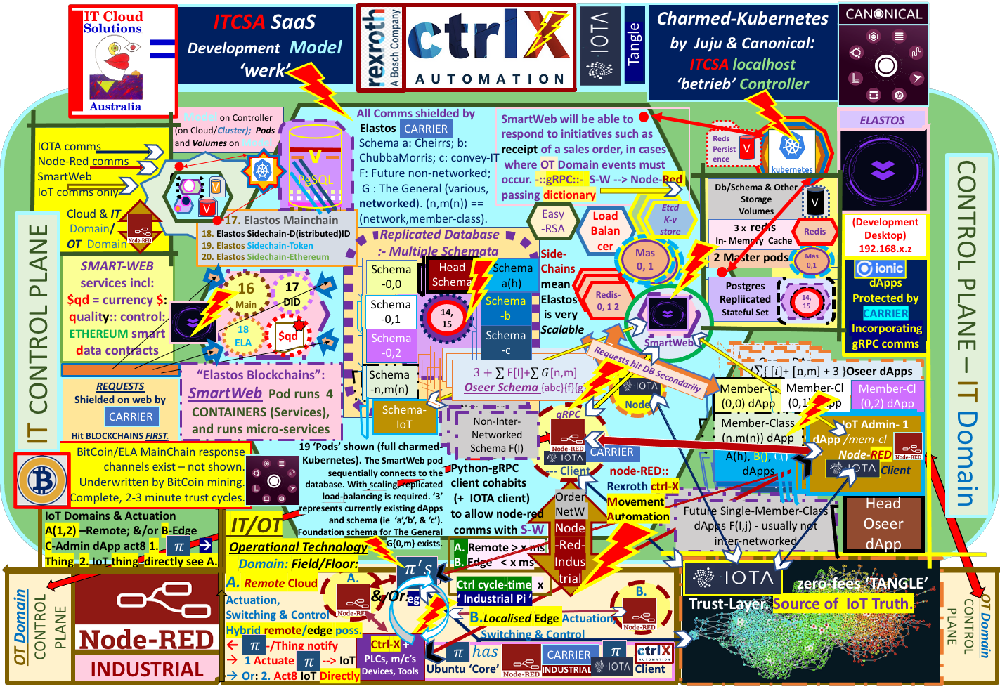
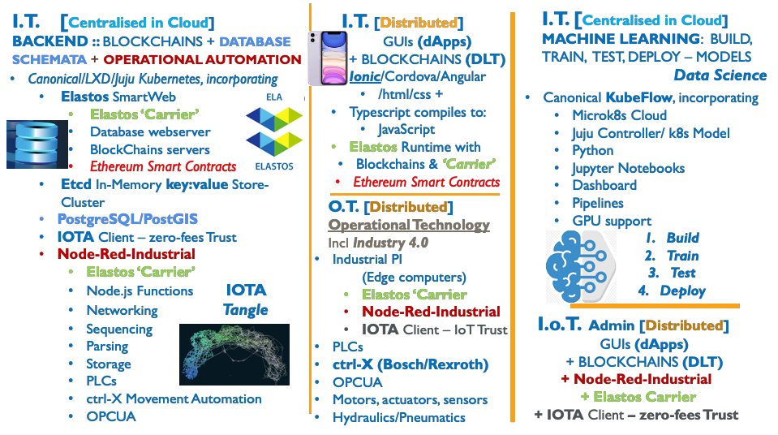

## Complete Enterprise DApp for Community Housing in Australia, Housing Associations in UK, and, eventually, dApps for your Real Estate Agency, for general Conveyancing needs and for multi-networked Enterprise trading on smart contracts.

# au.com.itcsolutions.cheirrs

Hi, 

This repo has morphed into CHEIRRS, a community housing dApp still aiming to include the Chubba Morris dApp, for Real Estate Agents, eventually, beside CHEIRRS.

CHEIRRS stands for Community Housing Enterprise Information Recording and Reporting System. We also have plans to develop our 'The General' dApp, a multi-networked System of private intra- & inter-Enterprise accounting, with smart-contract-enabled trading and supply, alongside 'convey-IT', our proposed Land Title Registration dApp for Solicitors, Conveyancers, Agents, Developers, Financial Institutions, Buyers and Sellers. 

There is a public repository at https://github.com/john-itcsolutions/cheirrs, to which the Front End in this repository (au.com.itcsolutions.cheirrs) is designed to connect.

See the following figure:



It is a Kubernetes-based repo, designed for intallation of a juju charms kubernetes system, with Blockchain-Database Server ('smart-web' installed directly on the kubernetes-workers), and also includes a KubeFlow/TensorFlow model for development of Machine Learning Workflows on a separate local virtual 'cloud' controller. The 2 controllers ('betrieb', and 'kubefluss') represent a very powerful basis upon which to build a multi-tenancy and multi-networked installation fully connected to the Elastos System of Blockchains for Distributed Identities (DID-SideChain), Main information recording (Main-Chain), Token exchange and storage (Token-SideChain) and the Ethereum Sidechain (ETH-SideChain) for Smart Contract Operations.

On that repo you will find the 'smart-web' server, which provides access for requests from this cheirrs Front End to the PostgreSQL 'haus' database, via JavaScript calls to gRPC protocol buffers (yet to be) included in au.com.itcsolutions.cheirrs, but getting ready now, to be implemented in python3.

The 'haus' database incorporates the cheirrs, cheirrs_oseer, das_fuhrwerk and other schema (for other dApps) for the database to store, compute/process and report on data. The database backup files are private, and not made available in the public repository.

The das_fuhrwerk schema is our company's own supervising schema for overseeing all operations at the topmost level, including the billing and accounting for customer enterprises, and our own planning, accounting, managing and reporting activities.

The cheirrs_oseer schema is responsible for overseeing Business Processes on the cheirrs schema. A similar approach is employed for the Chubba Morris (Real Estate Agencies), convey-IT and The General packages, with a user-level schema, and a supervising schema to programmatically oversee the user-level Business Processes.

The smart-web server simultaneously provides a way of recording relevant auditable information and smart contract data on the relevant Elastos Blockchains in between writing to and reading data from 'haus'. Blockchain sections of all transactions occur first in the sequence of requests sent from the Front End dApp to the smart-web server (via gRPC protocols), with PostgreSQL database requests occurring secondarily, in order to ensure integrity of the data. This is because the Blockchains are immutable and serve as the ultimate sources of Truth about transaction input and result. The PostgreSQL calls are meant to write the 'bulk' transaction data to the centralised 'haus' Enterprise Relational Database (eventually situated in a public Cloud), rather than storing excessive amounts of data on Blockchains, which would be more expensive.

ITCSA also is in the process of incorporating the IOTA fee-free Tangle (not, strictly, a Blockchain, as no actual Mining is involed. Mining is replaced by an arrangement where each Transaction must validate 2 others before completing). IOTA is designed to Industry 4.0 Standards for the Internet of Things, as a Trust Layer, allowing a reference against which participants' IoT actions can be verified and validated. The IOTA response  cycle-time is measured in seconds.

Currently (April 2021) the Elastos Trinity Tech Team are developing an entirely revised method and structure for coding of Ionic front ends for Elastos. Advice on migration, so that our repo may use the new 'Elastos Essentials' Structure, may be available after the expected first stable release around July, 2021.

The old Trinity-CLI will be discontinued in favour of using the native Ionic development/debugging/deployment process lifecycle instead of the old Trinity-CLI Toolchain. In addition Cordova Plugins will be accessed directly, rather than being wrapped inside Trinity methods and structures.

There will be built-in interfaces to the entire range of the Elastos Ecosystem including Carrier, Hive, Wallet, DID etc. All will be included in the single 'Elastos Essentials' package.

Our au.com.itcsolutions.cheirrs module would be downloadable from the Google Playstore in production, but also during development you need to be able to sign in and obtain DID's. The "container" for these modules for the developer, will be within 'Elastos Essentials'.

There will also be a means of development for the iOS operating system, and a means of installation most likely not involving the Apple Store.

Naturally the system will run on Ubuntu Linux Desktops for development.

In production, clients will be able to connect on supported Mobile Devices (Android and, eventually, iOS) and all Desktop browser based systems.

...

au.com.itcsolutions.cheirrs is an Ionic dApp. As such you will need to install openjdk etc (Java), some development packages, npm and node version 12:
```
# Base requirements 
sudo apt -y install openjdk-11-jdk build-essential curl dirmngr apt-transport-https lsb-release ca-certificates git
# Install NodeJS 12 instead of 8 or 10
curl -sL https://deb.nodesource.com/setup_12.x | sudo -E bash -
sudo apt -y install nodejs
```

as well as installing Ionic with:

`sudo npm i -g @ionic/cli`

`git clone https://github.com/john-itcsolutions/au.com.itcsolutions.cheirrs.0.01.git`

`cd au*`

In this project root directory:

`ionic serve`

Then have a look and see!

(Note: We do not yet fully understand the "angular router" now in use by ionic, so second-level menu selections have simply been hard-coded to a single option per page. Also the options' resulting pages are mostly blank.)

We like to call it our 'sea-level' dApp at the moment - you can't see much below the surface!

Here is a sample screenshot:


In src/assets/manifest.json you will find the place to 'whitelist' the necessary web addresses for your customers. Only addresses listed here can be accessed by your dApp, so this is where banks, your own central database, etc are listed. Any sites not in this list may not be accessed. The system of ultra-secure access involves the translating of normal web-addresses to an internally computed remapping of site addresses onto elastos 'nodes' (with temporary unique id's), with these nodes allowing access to the original ip address with no exposed web sockets. Elastos isolates itself.

The above Front End GUI (ie provided by this repo) connects via Python-based gRPC web connection (shielded by the Elastos 'Carrier' Global Security System), to a "Kubernetes" installation in the cloud which provides access to Elastos blockchains and the central Postgres Database.

It may be worth noting that every client's devices (whether mobile or desktop) actually run the identical blockchains to those on the webserver in the cloud (our "smart-web"). Although our work is called a "dApp" (for "distributed Application"), we could not succeed in this project if we had to store all enterprise data on blockchains. Incredibly expensive and if everyone did it the blockchains would be very slow and constantly choking. We simply must have a central store for enterprise data. This means transactions need to happen in the cloud as well as on devices. This requires blockchains to be running in the cloud and those blockchain servers to be controlling database transactions (not, for example, the other way round). This is because we rely on blockchains to provide an immutable source of Truth about transactions, underwritten by BitCoin "Merge-Mining". (See the Elastos Whitepaper https://www.elastos.org/downloads/elastos_whitepaper_en.pdf).

The Kubernetes installation's Status Board looks like this:


Our "smart-web" server (the heart of the Elastos System) is installed on kubernetes-worker-0 (at 10.57.133.224, et al. in the figure), and communicates with the postgresql database, whose replica are labeled pg-a/0 and pg-a/1. The actual blockchains (4 of them) are inside 4 containers within smart-web. The smart-web server obviously also communicates with the client dApps (Front Ends). In addition worker-1 participates in an Internet of Things system as the lynchpin between the edge-connected node-red-industrial servers (ie connected to IoT devices in the field), the IoT schema on postgres, and the Administration dApp monitoring events. All interconnections to smart-web rely upon gRPC protocol buffers, an invention of Google's. All web communications are shielded by Elastos Carrier.

The schematic Figure at the head of this article matches the above installation, as well as showing the various dApps planned-for in the future.

Further instructions will become available as Elastos Essentials is developed. At this stage we offer the following:

In order to progress to a version of our dApp (at au.com.itcsolutions.cheirrs.0.01) that can provide connection to the Elastos DID, Hive and other systems, we have had to carefully insert this repo's files into a copy of the Elastos.Essentials repo locally (at Elastos.Essentials/App/src/). There are some files (such as src/app/app-routing.module.ts) which need to be merged very carefully. We also added a "pages" directory in src/app/ and copied all our hundreds of developed pages there. There is still work to be done in this area, but note that as we do not own the Elastos.Essentials wrapper app we are unable to host our own merged code on any git repo. This development seems to have to be completed entirely locally. 

A selective approach must be taken when considering whether files should be copied as-is or not copied or merged with existing files at a finer-grained level. The benefits are that a secure and fully authenticated environment is gained for an otherwise straightforward Ionic App, where consumers/clients own their data in a hybrid web 2.0/web 3.0 arrangement. The web 2.0 part refers to the necessary centralised database in the cloud on Kubernetes, and the web 3.0 part refers to the blockchains and general Elastos connectivities.

Access Ionic documentation for further information on developing in Ionic.

https://ionicframework.com/docs

Keep in touch with 'Elastos Essentials' news at:

https://elastos.info/the-new-elastos-essentials/

and other associated Blogs on that site.

Keep in touch with 'Elastos.Essentials' development on github, at:

## https://github.com/elastos/Elastos.Essentials

_____________________________________________________________________________________

The current state of our infrastructure can be represented as follows:



_____________________________________________________________________________________

## My LinkedIn:

https://www.linkedin.com/in/john-lloyd-olsen/


